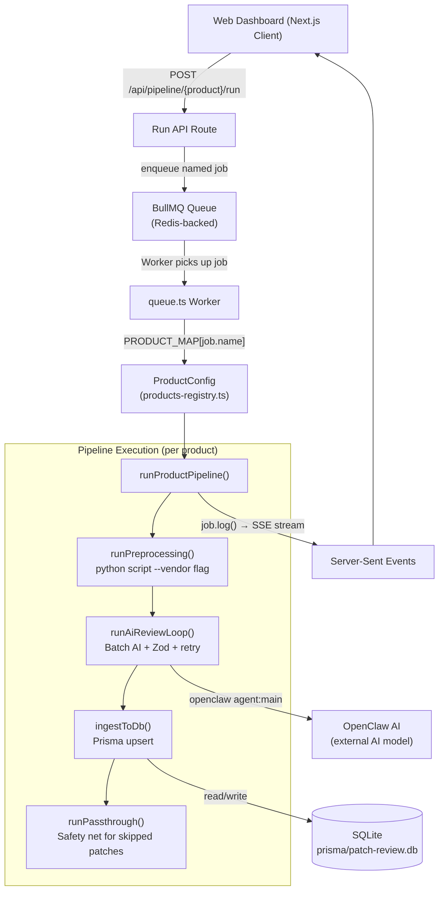

# Patch Review Dashboard V2 — Architecture

> All information here reflects the actual running infrastructure. No mock assumptions.

---

## 1. High-Level Architecture

The system is organized into three primary tiers:

1. **Frontend Presentation Layer** — Next.js 16 App Router
2. **Backend API & Queue Orchestration Layer** — Next.js API Routes + BullMQ Worker
3. **AI Pipeline Execution Layer** — Python Preprocessing + OpenClaw AI Agent



---

## 2. Central Product Registry

The v2 architecture's core innovation is `src/lib/products-registry.ts`. This single file defines a `ProductConfig` interface and an array of 13 active products (`PRODUCT_REGISTRY`). Every part of the system that needs product-specific information reads it from this registry.

**Before (v1):** Product-specific strings, paths, and logic were duplicated across 9+ files. Adding a new product required editing all of them.

**After (v2):** Add one entry to `PRODUCT_REGISTRY`. All routes, the queue worker, the export API, and the UI automatically use the new product.

```
src/lib/products-registry.ts
  └─ ProductConfig interface      (38 typed fields)
  └─ PRODUCT_REGISTRY array       (13 active + 2 inactive placeholders)
  └─ PRODUCT_MAP                  (keyed by product id, active only)
  └─ getSkillDir(cfg)             (resolves ~/.openclaw/.../patch-review/...)
```

See [Product Registry Documentation](product_registry.md) for the full field reference.

---

## 3. BullMQ Job Queue

In v1, pipelines were run via `child_process.spawn()` with a `pipeline_status.json` file-based lock. In v2, BullMQ manages all job lifecycle:

| Concern | v1 | v2 |
|---------|----|----|
| Job dispatch | `spawn()` in API route | `queue.add(jobName, data)` |
| Concurrency lock | `pipeline_status.json` file | BullMQ built-in serialization |
| Job status | polled from file | BullMQ job state (active/waiting/completed) |
| Streaming | child stdout piped to SSE | `job.log()` streamed via `/api/pipeline/stream` |
| Resume after restart | not supported | BullMQ job survives server restart |

Each product has a dedicated named job (`run-redhat-pipeline`, `run-ceph-pipeline`, etc.). The single worker in `queue.ts` handles all of them via a `PRODUCT_MAP` lookup.

---

## 4. Linux Pipeline Split

In v1, all three Linux vendors (Red Hat, Oracle, Ubuntu) ran inside a single `run-pipeline` job that called `patch_preprocessing.py` without arguments, processing all three `*_data/` directories at once.

In v2, each Linux vendor has its own independent job:
- `run-redhat-pipeline` → calls `patch_preprocessing.py --vendor redhat`
- `run-oracle-pipeline` → calls `patch_preprocessing.py --vendor oracle`
- `run-ubuntu-pipeline` → calls `patch_preprocessing.py --vendor ubuntu`

This symmetry means Linux products are now handled identically to all other products — no special cases in the worker.

---

## 5. Generic Pipeline Execution

`queue.ts` exposes one core function: `runProductPipeline(job, productCfg, isAiOnly, isRetry)`. Every product — Linux, Windows, databases, storage, virtualization — runs through this same function. Product-specific behavior is entirely driven by the `ProductConfig` object:

```
runProductPipeline
  │
  ├── if !isAiOnly → runPreprocessing()
  │     └── python <preprocessingScript> <preprocessingArgs>
  │
  ├── runAiReviewLoop()
  │     ├── RAG exclusion setup (based on ragExclusion.type)
  │     │     ├── 'prompt-injection' → query_rag.py → inject into prompt
  │     │     └── 'file-hiding'      → rename normalized/ dir
  │     ├── batch loop (size 5)
  │     │     ├── cleanupSessions()  (delete sessions.json between batches)
  │     │     ├── openclaw agent:main --json-mode
  │     │     ├── extractJsonArray() + Zod validation
  │     │     └── retry up to 2x with error injected into prompt
  │     └── undo RAG exclusion (restore renamed dirs/files)
  │
  ├── ingestToDb()
  │     └── Prisma upsert: PreprocessedPatch + ReviewedPatch
  │
  └── runPassthrough()  (if productCfg.passthrough.enabled)
        └── find PreprocessedPatch not in ReviewedPatch → upsert as Pending
```

---

## 6. Database Schema

Managed via Prisma ORM, SQLite backend at `prisma/patch-review.db`:

| Model | Purpose |
|-------|---------|
| `RawPatch` | Raw JSON from vendor APIs (caching layer) |
| `PreprocessedPatch` | Normalized patch data ready for AI review |
| `ReviewedPatch` | Final AI-reviewed or human-approved patches (unique by `issueId`) |
| `UserFeedback` | Admin exclusion history used for RAG context |
| `PipelineRun` | Pipeline execution metadata (status, logs) |

---

## 7. API Routes

### Product-specific run/finalize pairs
Each product category has dedicated endpoints:

| Product | Run Endpoint | Finalize Endpoint |
|---------|-------------|------------------|
| Red Hat / Oracle / Ubuntu | `POST /api/pipeline/run` | `POST /api/pipeline/finalize` |
| Windows Server | `POST /api/pipeline/windows/run` | `POST /api/pipeline/windows/finalize` |
| Ceph | `POST /api/pipeline/ceph/run` | `POST /api/pipeline/ceph/finalize` |
| MariaDB | `POST /api/pipeline/mariadb/run` | `POST /api/pipeline/mariadb/finalize` |
| SQL Server | `POST /api/pipeline/sqlserver/run` | `POST /api/pipeline/sqlserver/finalize` |
| PostgreSQL | `POST /api/pipeline/pgsql/run` | `POST /api/pipeline/pgsql/finalize` |
| MySQL | `POST /api/pipeline/mysql/run` | `POST /api/pipeline/mysql/finalize` |
| VMware vSphere | `POST /api/pipeline/vsphere/run` | `POST /api/pipeline/vsphere/finalize` |
| JBoss EAP | `POST /api/pipeline/jboss_eap/run` | `POST /api/pipeline/jboss_eap/finalize` |
| Apache Tomcat | `POST /api/pipeline/tomcat/run` | `POST /api/pipeline/tomcat/finalize` |
| WildFly | `POST /api/pipeline/wildfly/run` | `POST /api/pipeline/wildfly/finalize` |

### Shared operational endpoints

| Endpoint | Purpose |
|----------|---------|
| `GET /api/pipeline` | Check for active jobs |
| `GET /api/pipeline/stream?jobId=X` | SSE stream for job logs |
| `GET /api/pipeline/stage/[stageId]` | Get patch data at a pipeline stage |
| `GET /api/pipeline/export?categoryId=X` | Download merged CSV for a category |
| `POST /api/pipeline/feedback` | Submit user exclusion feedback |
| `POST /api/pipeline/reset` | Reset pipeline state |
| `GET /api/products` | Product list with stage counts |

---

## 8. Frontend Components

```
src/
  app/
    page.tsx                    — Root: redirects to /category/os
    category/[categoryId]/      — Category page (OS / Database / Storage / Virtualization / Middleware)
      [productId]/
        page.tsx                — Server component: loads product data
        ClientPage.tsx          — Client: patch review table, finalize action
      archive/                  — Archive viewer
  components/
    ProductGrid.tsx             — Product cards + pipeline trigger UI + SSE progress
    PremiumCard.tsx             — Individual product card with stage counters
    StageJSONViewer.tsx         — Modal for viewing raw stage JSON data
    LanguageToggle.tsx          — KO/EN language switch
```

`ProductGrid.tsx` handles all real-time pipeline state: SSE connection, log tail display, confirm dialog, and triggering the run/AI-only/retry actions. The generic log tag regex `\[\w+-PREPROCESS_DONE\]` and `\[\w+-PIPELINE\]` means no code changes are needed when a new product is added.
