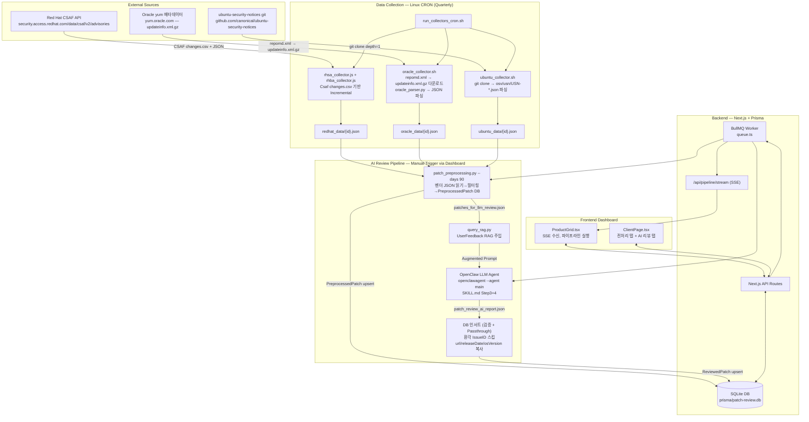

# 🏗️ Patch Review Dashboard — System Architecture

> **Last Updated**: 2026-03-11 | **Version**: v2 (CRON-based Collection)

본 문서는 **Patch Review Dashboard v2**의 전체 아키텍처를 설명합니다.
시스템은 **독립 실행 데이터 수집 (CRON)** 과 **AI 리뷰 파이프라인 (Dashboard-triggered)** 의 두 축으로 분리 운영됩니다.

---

## 🧭 System Overview



---

## 🗂️ Component Breakdown

### 1. Data Collection — CRON (`pipeline_scripts/`)

> **수집은 파이프라인 실행과 완전히 분리**됩니다. Linux crontab이 분기별로 자동 실행합니다.

| 스크립트 | 대상 | 동작 방식 | 출력 |
|---|---|---|---|
| `redhat/rhsa_collector.js` | Red Hat Security Advisory | CSAF `changes.csv` 기반 Incremental Fetch → `https://security.access.redhat.com/data/csaf/v2/advisories/` | `redhat_data/{rhsa_id}.json` |
| `redhat/rhba_collector.js` | Red Hat Bug Advisory | 동일 CSAF API | `redhat_data/{rhba_id}.json` |
| `oracle/oracle_collector.sh` | Oracle Linux Errata (OL7~10) | yum.oracle.com에서 `repomd.xml` → `updateinfo.xml.gz` 다운로드 (BaseOS + UEK + AppStream) → `oracle_parser.py` 호출 | `oracle_data/{elsa_id}.json` |
| `oracle/oracle_parser.py` | updateinfo.xml.gz 파싱 | gzip 해제 → XML 파싱 → 날짜 필터 → JSON 저장 | `oracle_data/{advisory_id}.json` |
| `ubuntu/ubuntu_collector.sh` | Ubuntu 22.04 LTS + 24.04 LTS USN | `ubuntu-security-notices` git repo clone (depth=1) → `osv/usn/USN-*.json` 파싱 → jq 변환 | `ubuntu_data/{usn_id}.json` |

**CRON 스케줄 (`run_collectors_cron.sh`)**:
- 수집 순서: redhat → oracle → ubuntu (순차 실행)
- 분기별 실행 권장 (분기 패치 데이터 수집)

---

### 2. AI Review Pipeline — Dashboard-triggered (`src/lib/queue.ts`)

대시보드에서 **"파이프라인 실행"** 클릭 시 BullMQ 큐에 Job 등록:

```
① PreprocessedPatch + ReviewedPatch DB 전체 삭제 (카운터 즉시 0 리셋)
② patch_preprocessing.py --days 90
   벤더별 JSON 파일 → 필터링 → PreprocessedPatch DB upsert
   → patches_for_llm_review.json 생성
   → [PREPROCESS_DONE] count=N 로그 (대시보드 카운터 실시간 갱신)
③ query_rag.py — UserFeedback 유사도 검색 → 프롬프트에 Exclusion Rules 주입
④ ~/.openclaw/agents/main/sessions/*.lock 자동 삭제 (stale lock 방어)
   openclaw agent --agent main --json -m "[프롬프트]"
⑤ AI 리포트 검증 → PreprocessedPatch 없는 IssueID 스킵 (환각 방지)
   → osVersion / url / releaseDate 를 PreprocessedPatch에서 복사 후 ReviewedPatch upsert
⑥ Passthrough: AI 미처리 PreprocessedPatch 항목 → ReviewedPatch 직접 upsert
   (criticality: Important, decision: Pending)
```

---

### 3. Database & ORM (`prisma/schema.prisma`)

| 테이블 | 설명 |
|---|---|
| `RawPatch` | 미사용 — 이력 보존용 (실제 수집 데이터는 JSON 파일로 관리) |
| `PreprocessedPatch` | 전처리 후 AI 검토 대상 패치 (`issueId`, `vendor`, `url`, `releaseDate`, `osVersion` 포함) |
| `ReviewedPatch` | AI + Passthrough 처리 완료 최종 패치 (한국어 설명, criticality, decision 포함) |
| `UserFeedback` | 관리자 Exclude 사유 — RAG 피드백 루프에 활용 |
| `PipelineRun` | 파이프라인 실행 이력 (status, logs) |

---

### 4. Web Dashboard (`src/app/`, `src/components/`)

- **Framework**: Next.js 16.1.6 App Router (React 19, TypeScript strict)
- **실시간 스트리밍**: BullMQ Job 로그를 `/api/pipeline/stream` (SSE)로 실시간 Push
  - `[PREPROCESS_DONE] count=N` 감지 → `router.refresh()` 로 카운터 즉시 갱신
  - `[PASSTHROUGH]` 로그로 AI 누락 패치 자동 보완 현황 표시
- **관리자 리뷰**: AI 리뷰 결과 탭에서 Approve/Exclude 처리, 피드백 제출

---

## 🛠️ Infrastructure

| 항목 | 상세 |
|---|---|
| **서버** | `tom26` / `172.16.10.237` |
| **OS** | Linux (Ubuntu) |
| **Node.js** | v22.22.0 (nvm 관리) |
| **Process Manager** | PM2 (`patch-dashboard`, fork mode, port 3000) |
| **Queue Broker** | Redis (BullMQ) |
| **AI Agent** | OpenClaw 2026.3.x (`openclaw agent --agent main`) |
| **DB** | SQLite (`prisma/patch-review.db`) |

> [!TIP]
> **분리 설계 원칙**: 데이터 수집(CRON)과 AI 리뷰(Dashboard)를 분리함으로써 수집 실패가 AI 리뷰에 영향 주지 않으며, 수집 없이도 AI 리뷰를 재실행할 수 있습니다.
