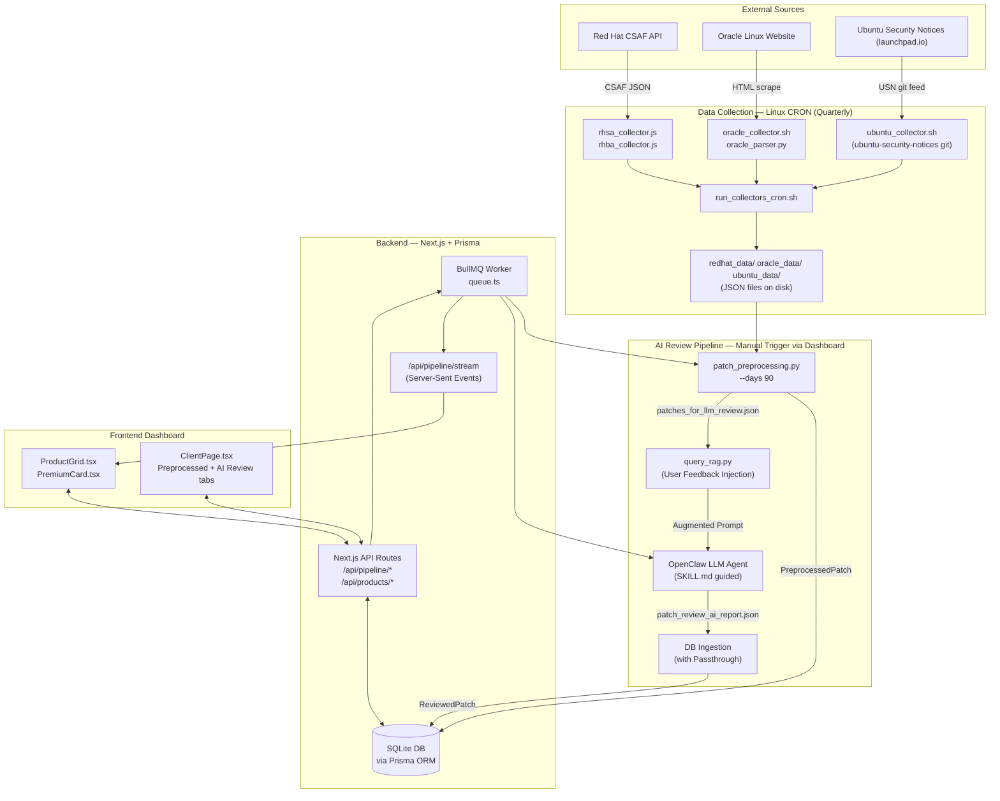

# 🏗️ Patch Review Dashboard — System Architecture

> **Last Updated**: 2026-03-11 | **Version**: v2 (CRON-based Collection)

본 문서는 **Patch Review Dashboard v2**의 전체 아키텍처를 설명합니다.
시스템은 **독립 실행 데이터 수집 (CRON)** 과 **AI 리뷰 파이프라인 (Dashboard-triggered)** 의 두 축으로 분리 운영됩니다.

---

## 🧭 System Overview



---

## 🗂️ Component Breakdown

### 1. Data Collection — CRON (`pipeline_scripts/`)

> **수집은 파이프라인 실행과 완전히 분리**됩니다. Linux crontab이 분기별로 자동 실행하며, 대시보드에서 수동 트리거 불가.

| 스크립트 | 대상 | 방식 | 출력 |
|---|---|---|---|
| `redhat/rhsa_collector.js` | Red Hat Security Advisory | CSAF REST API | `redhat_data/*.json` |
| `redhat/rhba_collector.js` | Red Hat Bug Advisory | CSAF REST API | `redhat_data/*.json` |
| `oracle/oracle_collector.sh` | Oracle Linux Errata | Web Scraping (curl) | `oracle/raw_html/` |
| `oracle/oracle_parser.py` | Oracle HTML 정제 | BeautifulSoup 파싱 | `oracle_data/*.json` |
| `ubuntu/ubuntu_collector.sh` | Ubuntu Security Notices | `ubuntu-security-notices` git repo | `ubuntu_data/*.json` |

**CRON 스케줄 (`run_collectors_cron.sh`)**:
```
0 6 * * * [매 분기 3번째 일요일] → 3월, 6월, 9월, 12월
```

---

### 2. AI Review Pipeline — Dashboard-triggered (`src/lib/queue.ts`)

대시보드에서 **"파이프라인 실행"** 버튼을 클릭하면 BullMQ 큐에 Job이 등록되고 순서대로 실행됩니다.

```
① DB 초기화 (PreprocessedPatch + ReviewedPatch 전체 삭제)
② patch_preprocessing.py --days 90 실행
   → 벤더별 JSON 파일 읽기 → 필터링 → PreprocessedPatch DB 저장
   → patches_for_llm_review.json 생성
③ query_rag.py 실행 — 사용자 피드백 RAG 주입
④ openclaw agent 실행 — SKILL.md 가이드 기반 AI 리뷰
   → stale .lock 파일 자동 제거 (재시도 방어)
⑤ AI 리포트 검증 및 DB 인서트
   → PreprocessedPatch 미포함 IssueID 스킵 (환각 방지)
   → osVersion / url / releaseDate 를 PreprocessedPatch에서 복사
⑥ Passthrough: AI가 누락한 벤더 항목을 PreprocessedPatch에서 직접 ReviewedPatch에 채움
```

---

### 3. Database & ORM (`prisma/schema.prisma`)

| 테이블 | 설명 |
|---|---|
| `RawPatch` | 과거 수집 원시 데이터 (현재 미사용, 이력 보존용) |
| `PreprocessedPatch` | 전처리 후 AI 검토 대상 패치 (issueId, vendor, url, releaseDate, osVersion 포함) |
| `ReviewedPatch` | AI 및 Passthrough 처리 완료 최종 패치 (한국어 설명, criticality, decision 포함) |
| `UserFeedback` | 관리자 제외(Exclude) 사유 — RAG 파이프라인으로 순환 |
| `PipelineRun` | 파이프라인 실행 이력 (status, logs) |

---

### 4. Web Dashboard (`src/app/`, `src/components/`)

- **Framework**: Next.js App Router (React Server Components)
- **실시간 스트리밍**: BullMQ Job 로그를 `/api/pipeline/stream` (SSE)로 브라우저 실시간 Push
  - `[PREPROCESS_DONE] count=N` 로그 감지 시 대시보드 카운터 즉시 갱신
  - `[PASSTHROUGH]` 로그로 AI 누락 패치 자동 보완 현황 표시
- **관리자 리뷰**: AI 리뷰 결과를 탭으로 분리하여 Approve/Exclude 처리 및 피드백 제출

---

## 🛠️ Infrastructure

| 항목 | 상세 |
|---|---|
| **서버** | `tom26` / `172.16.10.237` |
| **OS** | Linux (Ubuntu) |
| **Node.js** | v22.22.0 (nvm 관리) |
| **Process Manager** | PM2 (`patch-dashboard`) |
| **Queue Broker** | Redis (BullMQ) |
| **AI Agent** | OpenClaw 2026.3.x (`openclaw agent --agent main`) |
| **Dashboard Port** | 3000 (PM2 fork mode) |
| **DB** | SQLite (`prisma/patch-review.db`) |

> [!TIP]
> **분리 설계 원칙**: 데이터 수집(CRON)과 AI 리뷰(Dashboard)를 분리함으로써 수집 실패가 AI 리뷰에 영향 주지 않으며, 수집 없이도 AI 리뷰를 재실행할 수 있습니다.
