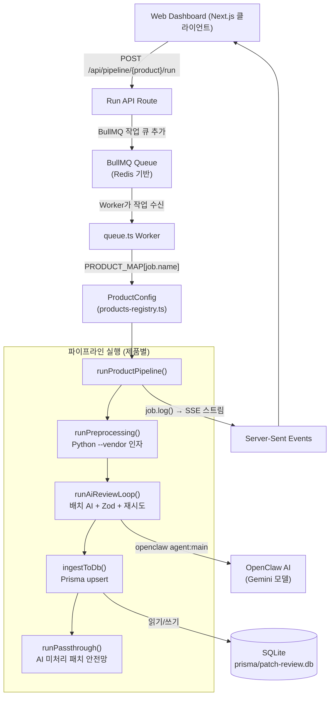

# 패치 리뷰 대시보드 V2 아키텍처

> 이 문서의 모든 내용은 추정이나 mock 데이터 없이 실제 운영 서버에서 구동 중인 코드를 기반으로 작성되었습니다.

---

## 1. 하이레벨 아키텍처

시스템은 세 가지 주요 계층으로 구성됩니다:

1. **프론트엔드 프레젠테이션 계층** — Next.js 16 App Router
2. **백엔드 API & 큐 오케스트레이션 계층** — Next.js API Routes + BullMQ Worker
3. **AI 파이프라인 실행 계층** — Python 전처리 + OpenClaw AI 에이전트



---

## 2. 중앙 제품 레지스트리

v2 아키텍처의 핵심 혁신은 `src/lib/products-registry.ts`입니다. 이 단일 파일이 9개 활성 제품의 모든 설정 정보를 정의합니다. 모든 라우트 핸들러, BullMQ 워커, 익스포트 API, 대시보드 UI가 이 레지스트리에서 제품 정보를 읽습니다.

**v1 문제**: 제품별 문자열, 경로, 로직이 9개+ 파일에 분산되어 있었음. 신규 제품 추가 시 전체 파일 수동 편집 필요 → 누락 시 버그 발생 (예: SQL Server가 MariaDB finalize 엔드포인트를 사용하는 문제)

**v2 해결**: `PRODUCT_REGISTRY`에 항목 1개 추가 → 모든 라우트, 워커, UI가 자동으로 신규 제품 인식

```
src/lib/products-registry.ts
  └─ ProductConfig 인터페이스  (38개 타입 필드)
  └─ PRODUCT_REGISTRY 배열    (활성 9개 + 비활성 플레이스홀더)
  └─ PRODUCT_MAP              (id 키 기반, 활성 제품만)
  └─ getSkillDir(cfg)         (~/.openclaw/.../patch-review/... 경로 해석)
```

상세 필드 설명은 [제품 레지스트리 문서](product_registry.md)를 참조하세요.

---

## 3. BullMQ 작업 큐

v1에서는 `child_process.spawn()` + `pipeline_status.json` 파일 기반 잠금으로 파이프라인을 실행했습니다. v2에서는 BullMQ가 모든 작업 생명주기를 관리합니다:

| 항목 | v1 | v2 |
|------|----|----|
| 작업 디스패치 | API Route에서 `spawn()` | `queue.add(jobName, data)` |
| 동시 실행 방지 | `pipeline_status.json` 파일 | BullMQ 내장 직렬화 |
| 작업 상태 | 파일 폴링 | BullMQ 작업 상태 (active/waiting/completed) |
| 스트리밍 | child stdout을 SSE로 파이핑 | `job.log()` → `/api/pipeline/stream` |
| 재시작 후 복구 | 미지원 | BullMQ 작업이 서버 재시작 후에도 유지 |

각 제품은 고유한 이름의 작업을 가집니다(`run-redhat-pipeline`, `run-ceph-pipeline` 등). `queue.ts`의 단일 워커가 `PRODUCT_MAP` 조회를 통해 모든 작업을 처리합니다.

---

## 4. Linux 파이프라인 분리

v1에서는 세 Linux 벤더(Red Hat, Oracle, Ubuntu)가 단일 `run-pipeline` 작업 안에서 `patch_preprocessing.py`를 인자 없이 실행하여 3개 `*_data/` 디렉터리를 한 번에 처리했습니다.

v2에서는 각 Linux 벤더가 독립적인 작업을 가집니다:
- `run-redhat-pipeline` → `patch_preprocessing.py --vendor redhat` 호출
- `run-oracle-pipeline` → `patch_preprocessing.py --vendor oracle` 호출
- `run-ubuntu-pipeline` → `patch_preprocessing.py --vendor ubuntu` 호출

이 대칭 구조로 Linux 제품이 다른 모든 제품과 동일하게 처리됩니다 — 워커에 특수 케이스 없음.

---

## 5. 제네릭 파이프라인 실행기

`queue.ts`는 핵심 함수 `runProductPipeline(job, productCfg, isAiOnly, isRetry)` 하나를 노출합니다. Linux, Windows, 데이터베이스, 스토리지, 가상화 — 모든 제품이 이 동일한 함수를 통해 실행됩니다. 제품별 동작은 전적으로 `ProductConfig` 객체에 의해 결정됩니다:

```
runProductPipeline
  │
  ├── !isAiOnly이면 → runPreprocessing()
  │     └── python <preprocessingScript> <preprocessingArgs>
  │
  ├── runAiReviewLoop()
  │     ├── RAG 배제 설정 (ragExclusion.type 기반)
  │     │     ├── 'prompt-injection' → query_rag.py → 프롬프트에 주입
  │     │     └── 'file-hiding'      → normalized/ 디렉터리 이름 변경
  │     ├── 배치 루프 (크기 5)
  │     │     ├── cleanupSessions()  (배치 간 sessions.json 삭제)
  │     │     ├── openclaw agent:main --json-mode
  │     │     ├── extractJsonArray() + Zod 검증
  │     │     └── 최대 2회 재시도 (에러를 프롬프트에 주입)
  │     └── RAG 배제 복원 (이름 변경된 디렉터리/파일 원복)
  │
  ├── ingestToDb()
  │     └── Prisma upsert: PreprocessedPatch + ReviewedPatch
  │
  └── runPassthrough()  (productCfg.passthrough.enabled인 경우)
        └── PreprocessedPatch 중 ReviewedPatch에 없는 것 → Pending으로 upsert
```

---

## 6. 데이터베이스 스키마

Prisma ORM으로 관리, SQLite 백엔드: `prisma/patch-review.db`

| 모델 | 용도 |
|------|------|
| `RawPatch` | 벤더 API에서 수집된 원시 JSON (캐싱 레이어) |
| `PreprocessedPatch` | AI 리뷰 준비 완료된 정규화 패치 데이터 |
| `ReviewedPatch` | 최종 AI 리뷰 또는 관리자 승인 패치 (`issueId`가 `@unique`) |
| `UserFeedback` | RAG 컨텍스트용 관리자 배제 이력 |
| `PipelineRun` | 파이프라인 실행 메타데이터 (상태, 로그) |

---

## 7. API 라우트

### 제품별 run/finalize 쌍

| 제품 | 실행 엔드포인트 | 완료 엔드포인트 |
|------|----------------|----------------|
| Red Hat / Oracle / Ubuntu | `POST /api/pipeline/run` | `POST /api/pipeline/finalize` |
| Windows Server | `POST /api/pipeline/windows/run` | `POST /api/pipeline/windows/finalize` |
| Ceph | `POST /api/pipeline/ceph/run` | `POST /api/pipeline/ceph/finalize` |
| MariaDB | `POST /api/pipeline/mariadb/run` | `POST /api/pipeline/mariadb/finalize` |
| SQL Server | `POST /api/pipeline/sqlserver/run` | `POST /api/pipeline/sqlserver/finalize` |
| PostgreSQL | `POST /api/pipeline/pgsql/run` | `POST /api/pipeline/pgsql/finalize` |
| VMware vSphere | `POST /api/pipeline/vsphere/run` | `POST /api/pipeline/vsphere/finalize` |

### 공유 운영 엔드포인트

| 엔드포인트 | 용도 |
|-----------|------|
| `GET /api/pipeline` | 활성 작업 확인 |
| `GET /api/pipeline/stream?jobId=X` | 작업 로그 SSE 스트림 |
| `GET /api/pipeline/stage/[stageId]` | 파이프라인 단계별 패치 데이터 조회 |
| `GET /api/pipeline/export?categoryId=X` | 카테고리별 병합 CSV 다운로드 |
| `POST /api/pipeline/feedback` | 사용자 배제 피드백 제출 |
| `POST /api/pipeline/reset` | 파이프라인 상태 초기화 |
| `GET /api/products` | 단계별 카운트 포함 제품 목록 |

---

## 8. 프론트엔드 컴포넌트

```
src/
  app/
    page.tsx                    — 루트: /category/os로 리다이렉트
    category/[categoryId]/      — 카테고리 페이지 (OS / Database / Storage / Virtualization)
      [productId]/
        page.tsx                — 서버 컴포넌트: 제품 데이터 로드
        ClientPage.tsx          — 클라이언트: 패치 리뷰 테이블, 완료 처리
      archive/                  — 아카이브 뷰어
  components/
    ProductGrid.tsx             — 제품 카드 + 파이프라인 실행 UI + SSE 진행 상황
    PremiumCard.tsx             — 단계별 카운터가 있는 개별 제품 카드
    StageJSONViewer.tsx         — 원시 단계 JSON 데이터 보기 모달
    LanguageToggle.tsx          — KO/EN 언어 전환
```

`ProductGrid.tsx`는 모든 실시간 파이프라인 상태를 처리합니다: SSE 연결, 로그 테일 표시, 확인 다이얼로그, 실행/AI 전용/재시도 액션 트리거. 제네릭 로그 태그 정규식 `\[\w+-PREPROCESS_DONE\]`, `\[\w+-PIPELINE\]`을 사용하므로 새 제품 추가 시 코드 변경 불필요.
