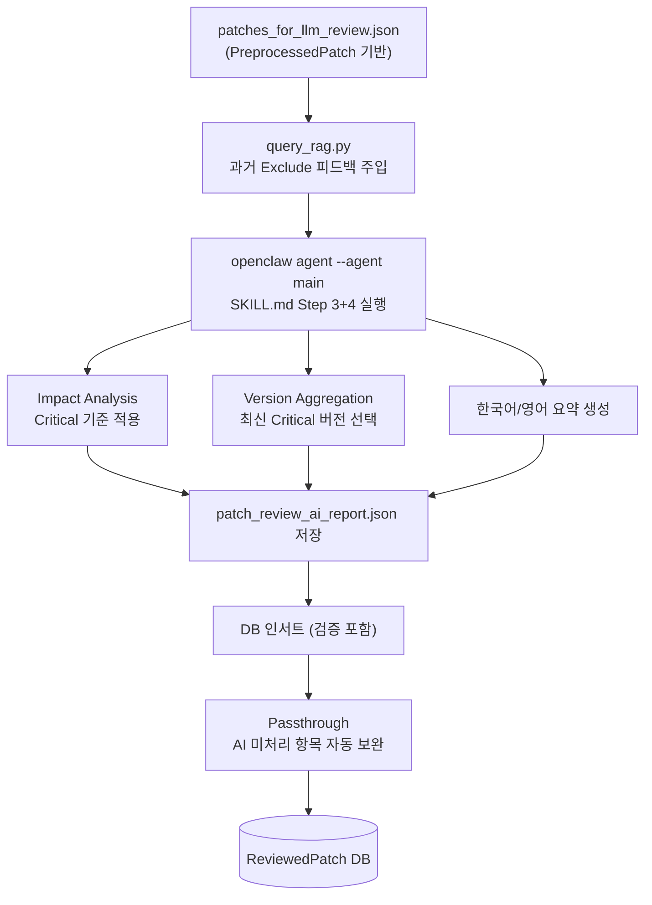

# 🧠 OpenClaw AI 기반 패치 리뷰 프로세스

> **Last Updated**: 2026-03-11 | **Agent**: OpenClaw 2026.3.x

본 문서는 `SKILL.md`의 지침에 따라 운영되는 **OpenClaw LLM 기반 지능형 패치 영향도 분석** 프로세스를 설명합니다.

---

## 🏗️ 전체 워크플로우



---

## 🔒 실행 전 방어 로직

| 방어 | 설명 |
|---|---|
| **Stale Lock 제거** | `~/.openclaw/agents/main/sessions/*.lock` 자동 삭제 — 이전 실행 크래시로 인한 `session file locked` 오류 방지 |
| **Zod 재시도** | AI 출력 JSON이 스키마 검증 실패 시 오류를 포함해 최대 2회 재시도 |
| **환각 방지** | `PreprocessedPatch`에 없는 IssueID는 인서트 스킵, `[SKIP]` 로그 기록 |
| **Passthrough** | AI가 누락한 벤더 항목을 `PreprocessedPatch`에서 직접 `ReviewedPatch`에 채움 |

---

## 🔎 SKILL.md 기반 AI 동작 상세

### Step 3. 심층 영향도 분석 (Impact Analysis)

AI는 `patches_for_llm_review.json`의 `full_text`와 `history`를 직접 읽어 **Critical System Impact** 기준으로 포함/제외를 판단합니다.

**✅ 포함 기준 (Criticality: Critical)**
| 분류 | 예시 |
|---|---|
| System Hang / Crash | 커널 패닉, Deadlock, 부팅 실패 |
| Data Loss / Corruption | 파일시스템 오류, RAID 손상 |
| Critical Performance | 서비스 불가 수준 성능 저하 |
| Security — RCE / Privilege | RCE, Root Escalation, Auth Bypass |
| Failover Failure | Pacemaker/Corosync HA 이슈 |

**❌ 제외 기준**
- 로깅 노이즈, 오타 수정 등 안정성 무관 변경
- Moderate 수준 취약점 (로컬 DoS, 정보 유출)
- Ubuntu 비 LTS 버전 전용 패치 (25.10 등)

> [!NOTE]
> SKILL.md의 필터링으로 일부 벤더가 누락될 수 있습니다.
> 이를 보완하기 위해 **Passthrough** 단계가 모든 `PreprocessedPatch`를 `ReviewedPatch`에 보장합니다.

---

### Step 4. 누적 버전 집계 & 리포트 생성

동일 컴포넌트가 분기 내 여러 버전으로 업데이트된 경우:

1. Critical 수정이 포함된 **최신 버전**을 대표 버전으로 선택
2. 과거 Critical 수정 내역과 최신 내용을 병합하여 Description 생성
3. `patch_review_ai_report.json` — 순수 JSON 배열, Markdown 없음

**각 항목 필수 필드**:
```json
{
  "IssueID": "RHSA-2026:1234",
  "Component": "kernel",
  "Version": "5.14.0-427.42.1.el9_4",
  "Vendor": "Red Hat",
  "Date": "2026-03-05",
  "Criticality": "Critical",
  "Description": "The kernel had a use-after-free vulnerability in ...",
  "KoreanDescription": "커널에서 UAF 취약점이 발견되어 권한 상승 공격이 가능했으며..."
}
```

---

## 💡 RAG 피드백 루프

관리자가 대시보드에서 패치를 **Exclude** 처리하면 사유가 `user_exclusion_feedback.json`에 저장됩니다.
다음 AI 리뷰 시 `query_rag.py`가 이 피드백을 유사도 검색으로 조회하여 프롬프트에 주입합니다.

```
"다음 패치들은 관리자가 명시적으로 제외 처리했습니다:
- RHSA-2025:9012, 사유: [Environment Mismatch] 해당 모듈 미사용"
```

이를 통해 동일/유사 패치의 반복 보고를 방지하여 오탐(False Positive)이 점진적으로 감소합니다.

---

## 🛡️ 오류 처리 및 UI 표시

| 오류 상황 | UI 표시 | 조치 |
|---|---|---|
| Session lock timeout | `❌ Pipeline Failed: session file locked` | "AI 리뷰만 재시도" 클릭 (자동 lock 삭제) |
| API Rate Limit | `❌ Pipeline Failed: API Rate Limit Error` | 잠시 후 재시도 |
| Gateway timeout | `❌ Pipeline Failed: Gateway agent failed` | OpenClaw 상태 확인 후 재시도 |
| JSON 파싱 실패 | Zod 재시도 최대 2회 자동 진행 | 3회 실패 시 에러 표시 |
