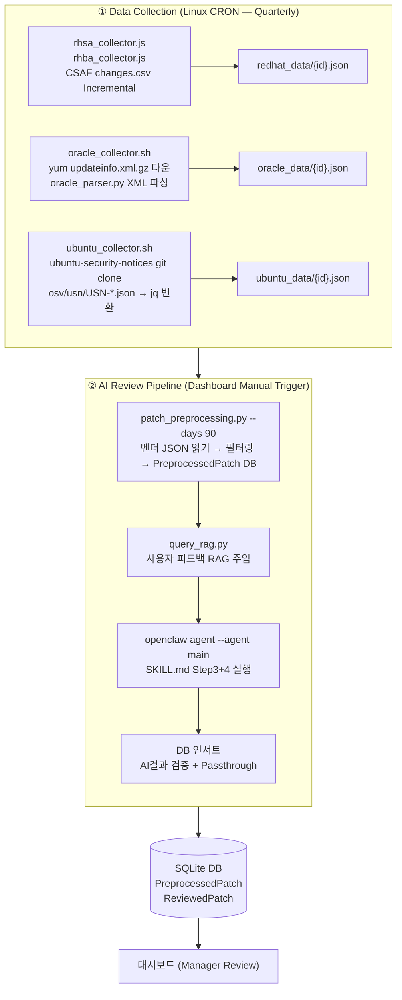

# 🌊 Data Pipeline Flow

> **Last Updated**: 2026-03-11 | **Version**: v2

전체 파이프라인은 **독립 수집(CRON)** 과 **통합 AI 리뷰(Dashboard)** 로 완전히 분리되어 있습니다.

---

## 🔄 End-to-End Workflow



---

## 🔍 Stage Detailed Breakdown

### Stage 1. 🌐 Data Collection (CRON)
> **실행 주체**: Linux crontab → `run_collectors_cron.sh`
> **실행 순서**: redhat → oracle → ubuntu (순차)

각 벤더별 독립 수집기가 순차 실행되며, 결과를 벤더 디렉토리의 JSON 파일로 저장합니다.

**Red Hat**: `rhsa_collector.js` + `rhba_collector.js`
- Red Hat CSAF API의 `changes.csv`(`security.access.redhat.com/data/csaf/v2/advisories/changes.csv`)를 폴링해 신규/갱신된 Advisory URL 확인 (Incremental 방식)
- 최대 동시 6개 요청으로 Advisory JSON Fetch
- `redhat_data/{advisory_id}.json` 으로 저장 (이미 존재하면 스킵)
- `redhat_data/metadata.json` 으로 마지막 실행 시각 및 max_timestamp 추적

**Oracle**: `oracle_collector.sh` + `oracle_parser.py`
- Oracle Linux **7~10** 각 버전의 **BaseOS / UEK / AppStream** 리포지토리 순회
- 각 리포지토리의 `repomd.xml` → `updateinfo.xml.gz` 를 `curl`로 직접 다운로드 (`yum.oracle.com/repo/OracleLinux/OL{버전}/...`)
- `oracle_parser.py`: gzip 해제 → XML 파싱 → 날짜 필터(90일, OL7 UEKR6은 180일) → `oracle_data/{advisory_id}.json` 저장
- Advisory URL: `https://linux.oracle.com/errata/{advisory_id}.html` (파서가 자동 생성)
- 이미 존재하는 파일은 스킵 (Incremental)

**Ubuntu**: `ubuntu_collector.sh`
- Canonical의 `ubuntu-security-notices` git repository를 **depth=1**로 클론
- `osv/usn/USN-*.json` 파일을 순회하여 **Ubuntu 22.04 LTS + 24.04 LTS** 에 해당하는 항목만 `jq`로 필터링
- 90일 이내 발행된 USN만 `ubuntu_data/{usn_id}.json` 으로 저장 (이미 존재하면 스킵)
- Advisory URL: `https://ubuntu.com/security/notices/{usn_id}` (jq 변환 시 자동 생성)

> [!NOTE]
> `ubuntu/ubuntu-security-notices/`는 외부 git repo입니다. 최초 배포 시 해당 디렉토리에서 `git clone https://github.com/canonical/ubuntu-security-notices.git` 실행 필요.

---

### Stage 2. 🧹 Preprocessing & Filtering (`patch_preprocessing.py`)

```bash
python3 patch_preprocessing.py --days 90
```

수집된 JSON 파일(`redhat_data/`, `oracle_data/`, `ubuntu_data/`)을 읽어 LLM-ready 형태로 필터링합니다.

| 처리 단계 | 상세 |
|---|---|
| 날짜 필터링 | 실행 기준 `--days` (기본 90일) 이내 패치만 처리 |
| Core Component 화이트리스트 | kernel, grub, shim, openssl, glibc, ssh, pam 등 시스템 핵심 컴포넌트만 포함 |
| 데스크탑 앱 제외 | firefox, libreoffice, gimp 등 서버 무관 패키지 제외 |
| EOL 버전 제외 | Ubuntu 14.04, 16.04 등 지원 종료 버전 스킵 |
| LTS 우선 (Ubuntu) | Ubuntu 비 LTS 버전(25.10 등)은 제외 |
| CVE 중복 제거 | 동일 CVE가 여러 Advisory에 포함된 경우 최신만 유지 |
| DB 저장 | `PreprocessedPatch` 테이블에 upsert (`issueId`, `vendor`, `url`, `releaseDate`, `osVersion` 포함) |
| JSON 생성 | `patches_for_llm_review.json` — AI에 전달할 최종 목록 |

**진행 로그**: `[PREPROCESS_DONE] count=N` 로그 발생 시 대시보드 카운터 실시간 갱신

---

### Stage 3. 🔍 RAG Injection (`query_rag.py`)

관리자의 피드백(`UserFeedback`)을 유사도 검색으로 조회하여 AI 프롬프트에 주입합니다.
과거 Exclude 처리된 패치와 유사한 항목이 반복 보고되지 않도록 방지합니다.

---

### Stage 4. 🤖 AI Review (OpenClaw + SKILL.md)

```bash
# ~/.openclaw/agents/main/sessions/*.lock 자동 삭제 (stale lock 방어)
openclaw agent --agent main --json -m "[프롬프트]"
```

- **프롬프트**: 총 패치 수 및 벤더별 수 명시, `patches_for_llm_review.json` 절대 경로 지정
- **출력**: `patch_review_ai_report.json` (순수 JSON 배열)
- **재시도**: Zod 스키마 검증 실패 시 최대 2회 자동 재시도

---

### Stage 5. 📥 DB Ingestion + Passthrough

**AI 결과 검증**:
- `PreprocessedPatch`에 없는 IssueID → 스킵 (`[SKIP] AI hallucinated issueId` 로그)
- `osVersion`, `url`, `releaseDate` → `PreprocessedPatch`에서 복사

**Passthrough**:
- AI가 처리하지 않은 `PreprocessedPatch` 항목을 `ReviewedPatch`에 직접 upsert
- criticality: `Important`, decision: `Pending`
- 모든 벤더(RedHat, Oracle, Ubuntu)의 전처리 패치가 최종 결과에 반드시 포함됨을 보장

---

### Stage 6. 👩‍💻 Manager Verification (Dashboard)

대시보드 **"AI 최종 리뷰 결과 (Summary)"** 탭에서 각 패치를 검토합니다.

- 각 패치 카드에 URL, OS 버전, 배포일 표시
- Approve/Exclude 처리 시 사유 입력 → `user_exclusion_feedback.json` → 다음 실행 시 RAG로 활용

> [!IMPORTANT]
> **재실행 시 주의**: "파이프라인 전체 실행"은 `PreprocessedPatch`와 `ReviewedPatch` 테이블을 모두 초기화한 후 시작합니다.
> "AI 리뷰만 재시도"는 전처리 데이터를 유지한 채 AI 단계(Stage 3~5)부터 재실행합니다.
