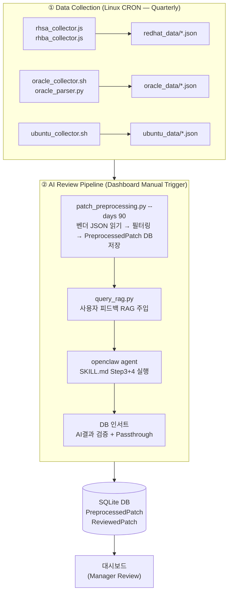

# 🌊 Data Pipeline Flow

> **Last Updated**: 2026-03-11 | **Version**: v2

전체 파이프라인은 **독립 수집(CRON)** 과 **통합 AI 리뷰(Dashboard)** 로 완전히 분리되어 있습니다.

---

## 🔄 End-to-End Workflow



---

## 🔍 Stage Detailed Breakdown

### Stage 1. 🌐 Data Collection (CRON)
> **실행 주체**: Linux crontab → `run_collectors_cron.sh`
> **실행 주기**: 분기별 3번째 일요일 06:00 (3월, 6월, 9월, 12월)

각 벤더별 독립 수집기가 순차 실행되며, 결과를 벤더 디렉토리의 JSON 파일로 저장합니다.

- **Red Hat**: `rhsa_collector.js` + `rhba_collector.js`
  - Red Hat의 CSAF API (`api.redhat.com/security/advisories/v1`)를 통해 RHSA/RHBA 목록 Fetch
  - 설정된 날짜 범위의 신규 Advisory를 `/os/linux-v2/redhat_data/` 에 JSON 파일로 저장
  
- **Oracle**: `oracle_collector.sh` + `oracle_parser.py`
  - Oracle Linux Errata 페이지를 curl로 긁어온 뒤 `oracle_parser.py`로 구조화
  - `/os/linux-v2/oracle_data/` 에 JSON 저장

- **Ubuntu**: `ubuntu_collector.sh`
  - Canonical의 `ubuntu-security-notices` git repository를 pull하여 USN 데이터베이스 동기화
  - 신규 USN JSON을 `/os/linux-v2/ubuntu_data/` 에 저장

> [!NOTE]
> `ubuntu/ubuntu-security-notices/`는 외부 git repo로, 최초 배포 시 `git clone` 필요:
> ```bash
> cd ubuntu && git clone https://github.com/canonical/ubuntu-security-notices.git
> ```

---

### Stage 2. 🧹 Preprocessing & Filtering (`patch_preprocessing.py`)

```bash
python3 patch_preprocessing.py --days 90
```

수집된 JSON 파일을 읽어 LLM-ready 형태로 필터링합니다.

| 처리 단계 | 상세 |
|---|---|
| 날짜 필터링 | 실행 기준 `--days` (기본 90일) 이내 패치만 처리 |
| Core Component 화이트리스트 | kernel, grub, shim, openssl, glibc, ssh, pam 등 시스템 핵심 컴포넌트만 포함 |
| 데스크탑 앱 제외 | firefox, libreoffice, gimp 등 서버 무관 패키지 제외 |
| EOL 버전 제외 | Ubuntu 14.04, 16.04 등 지원 종료 버전 스킵 |
| LTS 우선 (Ubuntu) | Ubuntu 비 LTS 버전(25.10 등)은 제외 |
| CVE 중복 제거 | 동일 CVE가 여러 Advisory에 포함된 경우 최신만 유지 |
| DB 저장 | `PreprocessedPatch` 테이블에 upsert (issueId, vendor, url, releaseDate, osVersion 포함) |
| JSON 생성 | `patches_for_llm_review.json` — AI에 전달할 최종 목록 |

**진행 로그**: `[PREPROCESS_DONE] count=N` 로그 발생 시 대시보드 카운터 실시간 갱신

---

### Stage 3. 🔍 RAG Injection (`query_rag.py`)

관리자의 피드백(UserFeedback)을 AI 프롬프트에 주입하여 과거 Exclude 사유와 유사한 패치가 반복 리포트되지 않도록 합니다.

```
user_exclusion_feedback.json → 벡터 검색 (유사도) → 프롬프트에 Exclusion Rules 추가
```

---

### Stage 4. 🤖 AI Review (OpenClaw + SKILL.md)

```bash
openclaw agent --agent main --json -m "[프롬프트]"
```

- **프롬프트 구성**:
  - 총 패치 수 및 벤더별 수 명시 (`Oracle: 30, Red Hat: 23, Ubuntu: 4`)
  - `SKILL.md` Step 3 (Impact Analysis) + Step 4 (JSON Generation) 수행 지시
  - 출력 파일 경로 절대 경로 명시 (`patch_review_ai_report.json`)
  
- **Session Lock 방어**: 이전 실행에서 남은 `.lock` 파일 자동 삭제 후 실행

- **AI 출력 검증**:
  - `PreprocessedPatch`에 없는 IssueID → 스킵 (환각 방지)
  - osVersion, url, releaseDate는 `PreprocessedPatch`에서 복사
  - Zod 스키마 검증 실패 시 최대 2회 자동 재시도

---

### Stage 5. 📥 DB Ingestion + Passthrough

```
AI 리포트 (5개 Ubuntu) + Passthrough (30개 Oracle + 23개 Red Hat)
                     ↓
         ReviewedPatch 테이블 (총 58개)
```

SKILL.md의 Impact 기준에 의해 AI가 일부 벤더를 선택적으로 누락할 수 있으므로, AI가 처리하지 않은 `PreprocessedPatch` 항목은 자동으로 `ReviewedPatch`에 직접 채워집니다 (criticality: `Important`, decision: `Pending`).

---

### Stage 6. 👩‍💻 Manager Verification (Dashboard)

대시보드 `AI 최종 리뷰 결과 (Summary)` 탭에서 각 패치를 검토하고 Approve/Exclude 처리합니다.

- Exclude 처리 시 사유 입력 → `user_exclusion_feedback.json` 저장 → 다음 실행 시 RAG로 활용
- URL, OS 버전, 배포일이 각 패치 카드에 표시
- AI 리뷰 결과와 전처리 데이터 탭을 교차 비교 가능

> [!IMPORTANT]
> **재실행 시 주의**: "파이프라인 전체 실행"은 `PreprocessedPatch`와 `ReviewedPatch` 테이블을 모두 초기화한 후 시작합니다. "AI 리뷰만 재시도"는 전처리 데이터를 유지한 채 AI 단계부터 재실행합니다.
