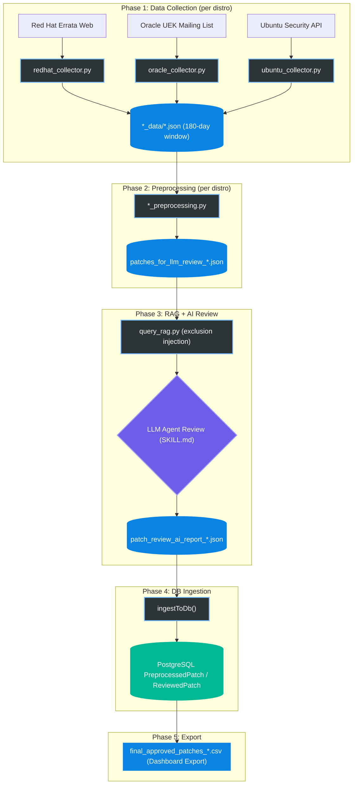

# Linux OS Patch Review Automation

*An end-to-end automated pipeline for collecting, preprocessing, analyzing, and reporting critical infrastructure patches.*

---

## Overview

The **Linux OS Patch Review Automation** sets the standard for proactive infrastructure stability. By leveraging web scraping, intelligent preprocessing, and LLM-based deep impact analysis, this pipeline filters through thousands of vendor advisories to pinpoint only the updates that prevent **System Crashes**, **Data Loss**, and **Critical Security Breaches**.

Each Linux distribution runs as an independent BullMQ queue job, allowing parallel execution across RHEL, Oracle Linux, and Ubuntu.

## Architecture & Workflow

The patch review process is divided into **five highly specialized stages**, ensuring zero noise and maximum operational stability.

---

## Core Components

<b>1. Per-Distro Collectors (Data Collection)</b>

 

Three independent Python collectors, each fault-tolerant and purpose-built for its source:

- **`redhat/`** -- `redhat_collector.py`: Scrapes Red Hat Errata web pages using DOM parsing. Handles pagination and rate limiting.
- **`oracle/`** -- `oracle_collector.py`: Parses Oracle UEK mailing list archives (Mailman). Extracts advisory metadata from plain-text email threads.
- **`ubuntu/`** -- `ubuntu_collector.py`: Queries the Ubuntu Security Notices API and traverses HTML advisories.

All collectors write normalized JSON to their respective `*_data/` directories with a **180-day collection window**.

<b>2. patch_preprocessing.py (Pruning & Aggregation)</b>

 

A per-product Python engine that translates chaotic vendor HTML/text into a standardized, parsed JSON payload.
- **Strict Whitelisting**: Only evaluates `SYSTEM_CORE_COMPONENTS` (e.g., kernel, filesystem, cluster, systemd, libvirt).
- **Distro Intelligence**: Filters out EOL Ubuntu versions, ignores unrelated OpenShift data, extracts specific component variants.
- **Aggregation**: Groups multiple minor point-releases of the same component into a unified cumulative history timeline to prevent LLM hallucination.
- **Review Scope**: From the 180-day collected pool, focuses AI review on the most recent **90-180 days** (kernel and critical components may use the full window).

<b>3. query_rag.py + SKILL.md (RAG-Augmented AI Review)</b>

 

Before each AI invocation, `query_rag.py` retrieves historically excluded patch entries and injects them as hard exclusion rules into the AI prompt. This prevents re-recommending patches that the operations team has already reviewed and declined.

**SKILL.md** is the definitive prompt instruction manual:
- **Decision Matrix**: Enforces strict inclusion rules for *System Hang, Data Loss, Boot Failures, and Critical CVEs*.
- **Cumulative Selection**: Instructs the LLM to identify the *latest critical version* within the review period.
- **Formatting Directives**: Mandates exact JSON schema compliance and high-quality dual-language descriptions.
- **Self-Healing Loop**: On schema validation failure, the error is fed back to the LLM for auto-correction (up to 3 retries).

<b>4. DB Ingestion (ingestToDb)</b>

 

After AI review, the queue worker upserts results into the PostgreSQL database:
- **`PreprocessedPatch`**: All patches in the preprocessing output (full candidate list).
- **`ReviewedPatch`**: AI-selected critical patches.
- **Passthrough**: Patches in scope but not selected by AI are recorded with `passthrough = true` for audit purposes.

<b>5. Dashboard Export</b>

 

The operations team exports final results from the web dashboard as per-distro CSV files:
- `final_approved_patches_redhat.csv`
- `final_approved_patches_oracle.csv`
- `final_approved_patches_ubuntu.csv`

Each record includes dual-language (English/Korean) descriptions and CVSS severity ratings.

---

## Target Distributions

| Vendor | OS / Kernel | Versions | Status | Collection Method |
| :--- | :--- | :--- | :---: | :--- |
| **Red Hat** | RHEL (Kernel, Glibc, Systemd, ...) | 8, 9, 10 | Active | Web DOM Scraping |
| **Oracle** | Oracle Linux (UEK) | 8, 9, 10 | Active | Mailing List Archive Parsing |
| **Canonical** | Ubuntu Server LTS | 22.04, 24.04 | Active | Security API + HTML Traversal |

> **Note**: EOL versions (Ubuntu 20.04 and earlier, RHEL 7 and earlier) are explicitly excluded during preprocessing to maintain focus on supported infrastructure.

---
*Maintained by the Infrastructure AI Engineering Team.*
